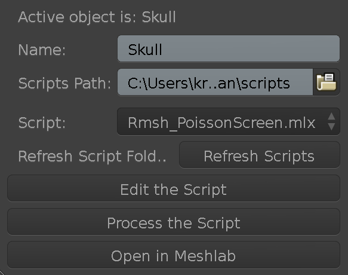

># Documentation

>>
># **Mesh Lab Gourmet**

>

> **Screenshot**

_See the bottom of the document for the release notes._

## Brief

>This addon intends to streamline editing and processing meshes in external applications  like Meshlab. At the moment it supports Meshlab only. The main goal of this addon is to make the Meshlab integration seamless so that you as the user don't need to worry about keeping track of the imports/export process and the continuous integration. 

## Features

* Run custom Meshlab scripts on the currently selected object.

* Add new Meshlab scripts to the scripts library while Blender is running.

* Open and edit the currently selected object in Meshlab for editing, it will import the edited mesh back.

* Edit the currently selected script in a text editor.

* It also works with vertex only meshes as long as the chosen Meshlab script supports it.

* It comes with a set of sample Meshlab script library.

* Linux, Windows, MacOS supported

## Planned

* Support Openflipper as one of the mesh processing backend.

* Support batch processing of multiple mesh objects.

* Support frame by frame processing. All the processed frames will be saved as individual mesh files.

* Selectable exchange format like .fbx or Collada. The addon is using .obj for the mesh exhange at the moment

* Better mesh processing progress display

* Ability to replace the original mesh

* Add a purposed script parameters panel for the selected script

* Clone scripts 

* Copy mesh/modifier/animation data from the original object

## Installation

>>### Requirements

>>> Blender 2.79

>>> Meshlab 2018 
>>>> Older versions of Meshlab might work but the addon is only tested with Meshlab 2018

>>**Option 1**: You can uncompress the downloaded zip file to  your Blender user/addons folder. Once the addon is copied there, you need to restart Blender or press `F8` to refresh the addon scripts.

>>**Option 2**: Open your Blender preferences. Then open the `Add-ons` tab. You can use `Install addon from file` in that  tab to install the zip file.

>>Once installed you need to enable it from the `Add-ons` tab. You can just search for `meshlabman` in the search bar. Then click on the checkbox and expand the addon for adding the required settings like `Meshlab 2018 folder` Once done save your preferences settings.

>>You can find the addon under object properties panel for the selected object. This current placement might change in the future releases.

## HowTo

## FAQ

* **Does it work with 2.8?**

>> There is going to be a 2.8 release very soon. 

* **Can I process point/vertex cloud in Meshlab via this addon?**

>> Yes, as long as you use the right scripts from Meshlab. The main thing is to maintain and include vertex normals for the point cloud for operations like remeshing.

* **Does it work with multiple selections**

>>It works with multiple selections, however the resulting processed mesh will be reimported as a single mesh. There are plans to implement batch processing for multiple selections.

* **Do you plan to support other mesh processing applications?**

>> Yes I would like to support more mesh backends in the future.

* **How can I create Meshlab scripts?**

>> First open Meshlab, then import your model. Start applying the filters you would like to your mesh in the order you want. Once done, goto `Top menu-> Filters -> Show current filter script` . You will see all your applied operations in that listing. Save the script by clicking `Save script`. Then you need to choose the default `scripts` folder that the addon uses, which is under your Blender's user addon folder. If you chose a custom script folder in the addon's preferences, then you can consider saving the script there.

>> There are two issues to consider. When you apply filters make sure you do not click on "preview" in the filter window in Meshlab, because Meshlab does not seem to record such filters. The second issue is that you need to make sure that the saved filter has a ".mlx" extension

* **I applied script X and I am getting some crazy results. Is the addon broken?**

>> If you are getting crazy results with your meshes after applying the processing it means that you need to refine the script according to your mesh size, topology etc. You can either do that by pressing `edit script` button in the addon panel or saving a new script right from Meshlab. It can take a bit of fiddling to get the right values.

* **My meshes are always triangulated. Can the addon import them as quads?**

>> Unfortunately this is how Meshlab works, all operations in  Meshlab are iterated over triangulated polygon data, therefor there is not much the addon can do. However there are plans to add other mesh processing backends like OpenFlipper. Meanwhile you can try "tris to quad" after import your mesh in edit mode.

* **Can I surface/remesh my particle animation data?**
>> Yes that is possible. You can instance  the particle cloud  to a single vertex (for example you can add a single vert object from the add object menu) Then process that new mesh item with the addon. At the moment it will only process the currently active frame. I am planning to add animated mesh processing for v2.

* **Where can I download Meshlab 2018**
>> The most recent releases can be found here, although they generaly release Mac version there, https://github.com/cnr-isti-vclab/meshlab/releases

>> You can download the most recent versions for Windows here, https://ci.appveyor.com/project/cignoni/meshlab/build/artifacts

## Release Notes for v1.1

* Option to keep the processed meshes in the temp folder
* Automatic conversion of imported meshes to quads from triangles
* The addon now detects no edits in Meshlab, no unnecessary imports anymore
* The exported mesh is triangulated prior to processing for better compability with MeshLab/MeshLabServer
* Object rotation is maintained across the versions
* Better handling of the imported mesh's pivot

## Release Notes for v1.2

* Blender 2.80 update
* Some scripts are updated

## Release Notes for v1.2.1

- Hot fix for 2.80